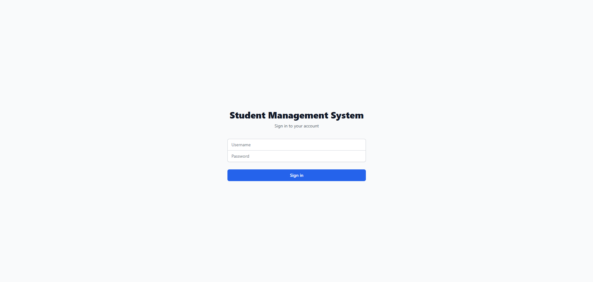
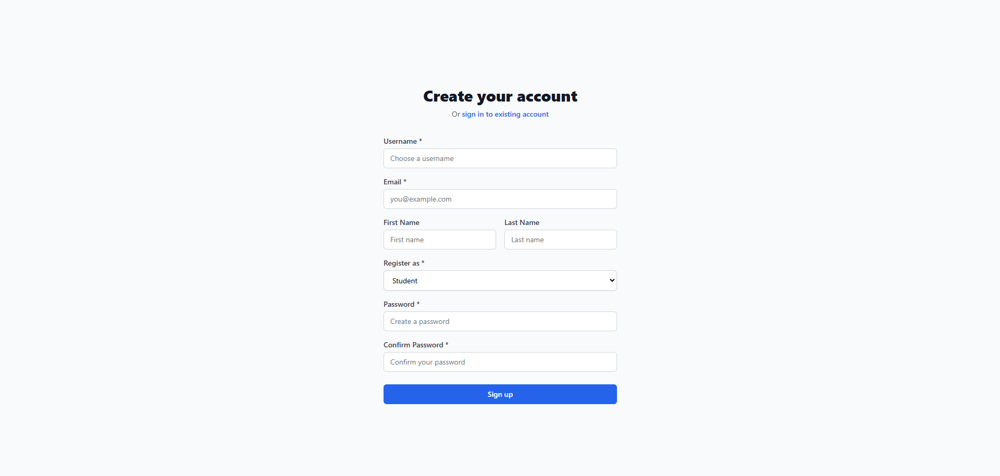
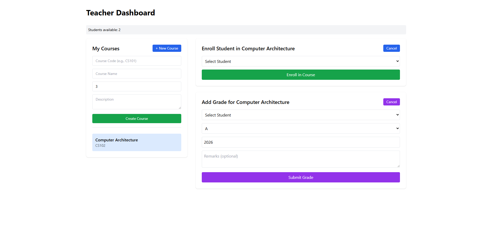
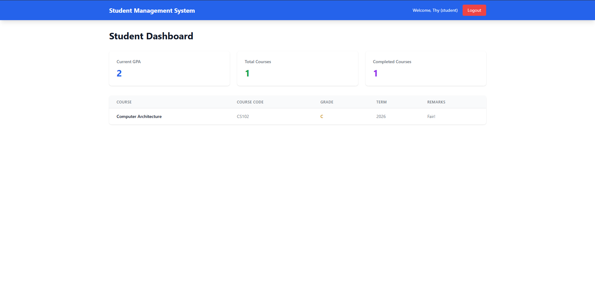
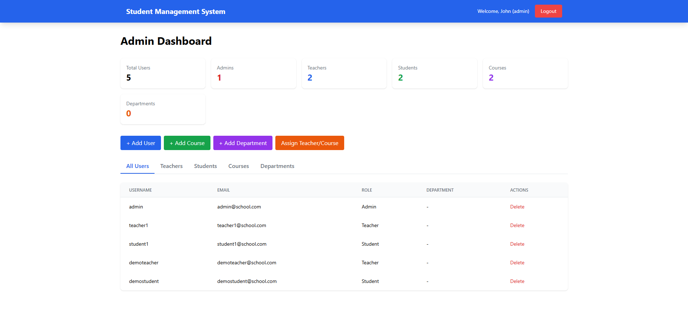

# 🎓 Student Management System

A full-stack web application for managing students, courses, enrollments, and grades.

## 🚀 Live Demo

- **Frontend:** https://student-management-system-smoky-delta.vercel.app
- **Backend Admin Panel:** https://student-management-system-x4mg.onrender.com/admin

### Test Credentials

| Role | Username | Password |
|------|----------|----------|
| 👑 Admin | admin | Admin123! |
| 👨‍🏫 Teacher | demoteacher | DemoPass123! |
| 👨‍🎓 Student | demostudent | DemoPass123! |

---

## 📸 Screenshots

| Login | Register |
|-------|-----------|
|  |  |

| Teacher Dashboard | Student Grades |
|-------------|----------------|
|  |  |

| Admin Dashboard |
|-------------|
|  |

---

## ✨ Features

### 👨‍🏫 Teachers
- Create, edit, delete courses
- Enroll students
- Enter grades (A-F)
- GPA calculation

### 👨‍🎓 Students
- View enrolled courses
- Track grades and GPA
- Academic progress

### 👑 Admins
- User management
- Course management
- Department organization

---

## 🛠️ Tech Stack

| Category | Technologies |
|----------|--------------|
| Backend | Django, DRF, PostgreSQL |
| Frontend | React, Tailwind CSS |
| Auth | JWT |
| Deployment | Render, Vercel |

---

## 👨‍💻 Author

**Seth** - [GitHub](https://github.com/Sethhxd)

---

⭐ Star this repo if you like it!

## 📦 Quick Start

```bash
# Clone
git clone https://github.com/Sethhxd/student-management-system.git
cd student-management-system

# Backend
python -m venv venv
source venv/bin/activate  # Windows: venv\Scripts\activate
pip install -r requirements.txt
python manage.py migrate
python manage.py runserver

# Frontend (new terminal)
cd frontend
npm install
npm start